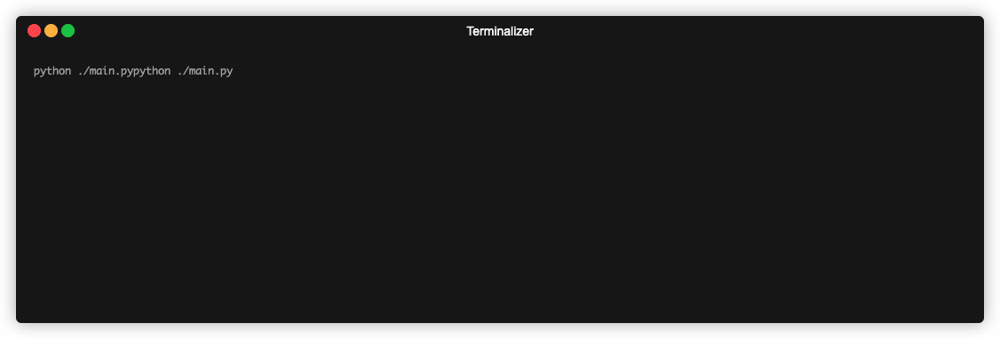

# Day-003: Treasure Island

## Overview
This is a simple text-based adventure game where players navigate through different choices to find the treasure. The game involves multiple decision points, and the outcome depends on the choices made by the player.

## Environment
Python Version: 3.8.15
Operating System: MacOS (14.2.1（23C71）)

## How to use
To run the game, execute the following command in the terminal:
```bash 
python main.py
```

## Demo

## Project Learned
- Using terminalizer to record terminal demo
- Using ASCII art resources to make beautiful printing in the terminal
- Learn about decision-based programming and branching logic.


## ASCII Gallery
Here are some great resources for finding ASCII art to make your terminal more interesting:
- [Emoji Combos](https://emojicombos.com)
- [ASCII ART](https://ascii.co.uk/art)