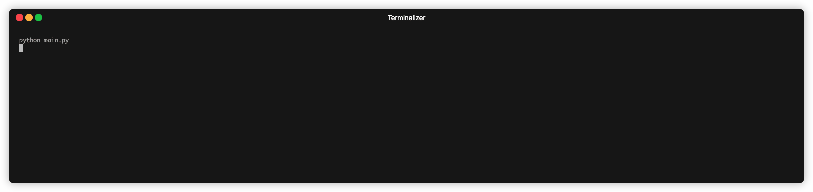

# Day-004: Rock Paper Scissors

## Overview
This is a simple Rock Paper Scissors game where players can play with computer.

## Environment
Python Version: 3.8.15
Operating System: MacOS (14.2.1（23C71）)

## How to use
To run the game, execute the following command in the terminal:
```bash 
python main.py
```

## Demo


## ASCII Gallery
Here are some great resources for finding ASCII art to make your terminal more interesting:
- [Emoji Combos](https://emojicombos.com)
- [ASCII ART](https://ascii.co.uk/art)