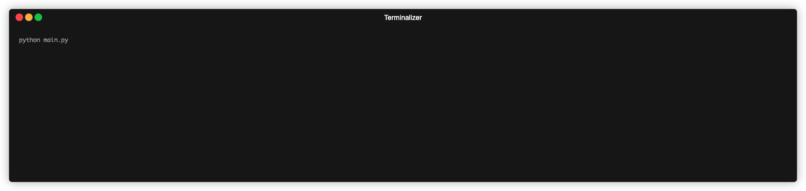

# Day-005: Password Generator

## Overview

This is a simple password generator that allows users to create strong passwords by specifying the number of letters, numbers, and symbols.

## Environment
Python Version: 3.8.15
Operating System: MacOS (14.2.1（23C71）)

## How to use
To run the password generator, execute the following command in the terminal:
```bash 
python main.py
```
Then, follow the program instructions to generate a password.

## Demo


## Project Learned
- Writing unit tests for a password generator using the **unittest** framework
