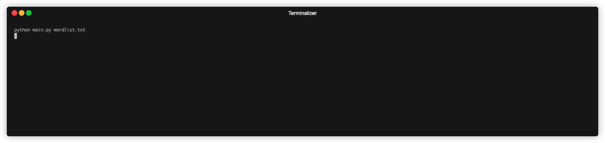

# Day-007: Hangman

## Overview

This is a simple implementation of the classic Hangman game, where players guess the letters of a word before running out of lives. The game can optionally load a custom word list or use a default list if no file is provided.

## Environment
Python Version: 3.8.15
Operating System: MacOS (14.2.1（23C71）)

## How to use
To start the game, run the following command in your terminal:
```bash 
python main.py {path_to_word_list_file.txt (Optional)}
```
- If you provide a word list file (e.g., word_list.txt), it will be used for the game.
- If no file is provided, the game will use a default word list.

## Demo


## Resources
- [Hangman word list](https://github.com/Tom25/Hangman/tree/master)
- [Hangman ASICC Art](https://gist.github.com/chrishorton/8510732aa9a80a03c829b09f12e20d9c)
- [ASCII ART](https://ascii.co.uk/art)