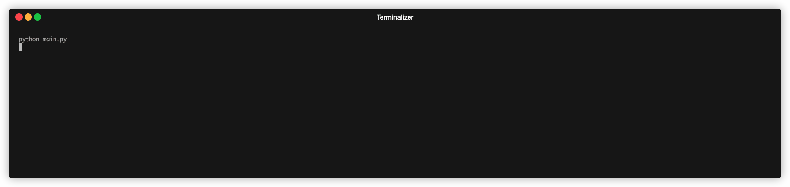

# Day-008: Caesar Cipher

## Overview
This project implements a simple Caesar Cipher, a basic encryption technique that shifts letters in the alphabet by a specified number of positions. Users can choose to either encrypt or decrypt a message interactively.

## Environment
Python Version: 3.8.15
Operating System: MacOS (14.2.1（23C71）)

## How to use
To run the Caesar Cipher, execute the following command in the terminal:
```bash 
python main.py
```
Then, follow the program instructions to either encrypt or decrypt a message.

## Demo



## Lessons Learned
- Understanding Parameters & Arguments
  - A parameter is the variable used in a function definition
  - An argument is the actual value passed to the function when calling it

- Positional & Keyword Arguments
  - Positional arguments must be provided in the correct order
  - Keyword arguments explicitly specify parameter names, improving readability and flexibility
