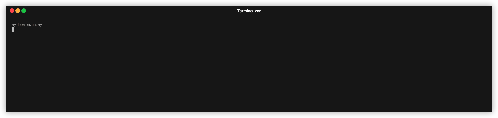

# Day-009: The Secret Auction

## Overview


## Environment
Python Version: 3.8.15
Operating System: MacOS (14.2.1（23C71）)

## How to use
To run the auction, execute the following command in the terminal:
```bash 
python main.py
```
then, follow the program instructions to start your bids!
## Demo

## Resource
- [ASCII ART](https://ascii.co.uk/art)